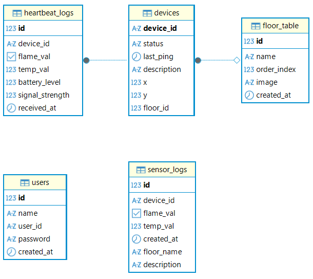

# Centralized Fire Detection System

## 프로젝트 소개
IoT 센서의 데이터와 LoRa 통신을 활용한 중앙 집중 화염 감지 센서

## 개발 기간
2026.04 ~ 2026.06.02

## 기술 스택

### Frontend
- HTML
- CSS
- JavaScript

### Backend
- Node.js
- Express

### Database
- PostgreSQL
- NeonDB

### IoT / Hardware
- Heltec LoRa 32 V3 (ESP32-S3)
- LoRa
- Raspberry PI 4B (4GB)
- MQTT

### 센서 구성
- OEM 화염 불꽃 감지 센서 (화염/불꽃 적외선 감지)
- DS18B20 (온도 감지)

### 회로

  

### 완성된 모습

  

## 시연 환경
노트북에 연결한 1개의 게이트웨이와 2개의 감지기를 기반으로 했습니다.
1. 실제 대시보드에서 disconnect 상태의 감지기가 active로 바뀌는 것을 보여주는 감지기 1대
2. 4층에서 송신해서 시연 장소인 2.5층에 있는 게이트웨이가 수신하는 것을 보여주는 감지기 1대

## 시스템 구조

  

## ERD

  

## 주요 기능
- 센서 데이터 수집
- 실시간 모니터링
- 사용자 관리
- 데이터 조회

## 담당 역할

### 직접 개발
- 실제 보드와 센서의 회로 구성 후 연결
- Heltec LoRa 32 V3 센서 제어 코드 작성
- Heltec LoRa 32 V3 ↔ Gateway 데이터 송수신 구현

### 프로젝트 기여
- 웹 디자인 와이어 프레임 제작
- Backend CRUD 프로토타입 제작
- REST API 설계 방향 제시
- 팀원 대상 CRUD 구조 및 구현 방법 공유
- DB 설계 검토